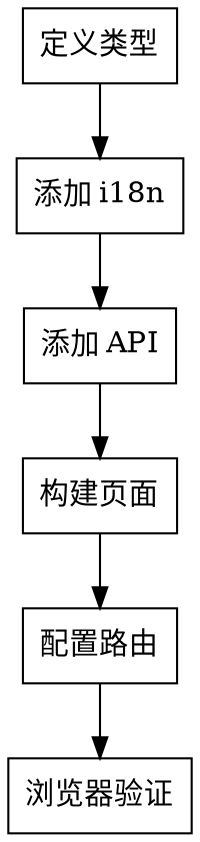

# AMS-AI 前端开发规范

## 概述

参考实现：`app-web/src/pages/admin/RoleManagementPage.tsx`

标准 CRUD 页面特性：
- 搜索输入状态与查询状态分离
- 服务端分页 (`page`, `size`, `x-total-count`)
- Dialog 方式的创建/编辑，支持关联选择

## 开发工作流



## 国际化 (i18n)

**所有用户可见文本必须使用 i18n**

### 添加翻译 Key

在两个语言文件中添加：
- `app-web/src/i18n/locales/zh-CN.json`
- `app-web/src/i18n/locales/en-US.json`

```json
{
  "pages": {
    "xManagement": {
      "title": "X管理",
      "searchPlaceholder": "搜索名称或编码...",
      "addButton": "新增X",
      "columns": {
        "code": "编码",
        "name": "名称",
        "description": "描述",
        "actions": "操作"
      },
      "dialog": {
        "createTitle": "新增X",
        "editTitle": "编辑X"
      },
      "form": {
        "code": "编码",
        "codePlaceholder": "请输入编码"
      },
      "messages": {
        "createSuccess": "创建成功",
        "updateSuccess": "更新成功",
        "deleteSuccess": "删除成功"
      }
    }
  }
}
```

### 命名规范

| Pattern | Example | Description |
|---------|---------|-------------|
| `pages.{pageName}.title` | `pages.roleManagement.title` | 页面标题 |
| `pages.{pageName}.columns.{field}` | `pages.roleManagement.columns.name` | 表格列 |
| `pages.{pageName}.form.{field}` | `pages.roleManagement.form.name` | 表单标签 |
| `pages.{pageName}.dialog.{action}` | `pages.roleManagement.dialog.createTitle` | 弹窗标题 |
| `pages.{pageName}.messages.{type}` | `pages.roleManagement.messages.createSuccess` | Toast 消息 |

### 使用方式

```tsx
import { useTranslation } from 'react-i18next';

const { t } = useTranslation();

// 页面标题
<CardTitle>{t('pages.xManagement.title')}</CardTitle>

// 输入框占位符
<Input placeholder={t('pages.xManagement.searchPlaceholder')} />

// Toast 消息
toast.success(t('pages.xManagement.messages.createSuccess'));
```

### 预定义通用 Key

使用 `common.*` 通用键：
- `common.loading`, `common.submit`, `common.cancel`, `common.confirm`
- `common.save`, `common.delete`, `common.edit`, `common.add`, `common.search`

## 类型定义

在 `app-web/src/utils/api.ts` 添加：

```typescript
export interface XQueryParams {
  page?: number;  // zero-based for backend
  size?: number;
  keyword?: string;
}

type Id = number | string;

export interface XItem {
  id: Id;
  code: string;
  name: string;
  description?: string;
}

export interface XPayload {
  code: string;
  name: string;
  description?: string;
  relatedIds?: Id[];
}

export interface PageResponse<T> {
  content?: T[];
  items?: T[];
  totalElements?: number;
  totalCount?: number;
}
```

## API 方法

在 `app-web/src/utils/api.ts` 添加：

```typescript
export const xApi = {
  getList: (params?: XQueryParams) =>
    apiClient.get<PageResponse<XItem>>('/system/x', { params }),
  create: (payload: XPayload) =>
    apiClient.post<XItem>('/system/x', payload),
  update: (id: Id, payload: XPayload) =>
    apiClient.put<XItem>(`/system/x/${id}`, payload),
  delete: (id: Id) =>
    apiClient.delete(`/system/x/${id}`),
};
```

## 表单开发规范

### shadcn Form 组件

项目使用 shadcn 风格的 Form 组件，适配 TanStack Form：

```tsx
import {
  FormItem,
  FormLabel,
  FormControl,
  FormDescription,
  FormMessage,
} from '@/components/ui/form';
```

### 基本用法

```tsx
<form.Field name="fieldName">
  {(field) => (
    <FormItem>
      <FormLabel required>{t('pages.xxx.form.fieldName')}</FormLabel>
      <FormControl>
        <Input
          value={field.state.value as string}
          onChange={(e) => field.handleChange(e.target.value)}
          onBlur={field.handleBlur}
          required
        />
      </FormControl>
      <FormDescription>Helper text</FormDescription>
      <FormMessage error={error} />
    </FormItem>
  )}
</form.Field>
```

### 必填项标记规则

- **必填项**：设置 `<FormLabel required>` 自动显示红色星号 `*`
- 必填项的 Input 也需要设置 `required` 属性

```tsx
// ✅ 正确
<FormItem>
  <FormLabel required>{t('pages.xxx.form.username')}</FormLabel>
  <FormControl>
    <Input required />
  </FormControl>
</FormItem>

// ❌ 错误 - 不要手动添加星号
<FormItem>
  <FormLabel>用户名*</FormLabel>
  <FormControl>
    <Input required />
  </FormControl>
</FormItem>
```

### 内联控件（Switch/Checkbox）

```tsx
<FormItem className="flex items-center gap-2 space-y-0">
  <FormControl>
    <Switch checked={value} onCheckedChange={setValue} />
  </FormControl>
  <Label className="cursor-pointer">{t('pages.xxx.form.enabled')}</Label>
</FormItem>
```

### 支持的输入控件

FormControl 支持所有标准输入控件：
- `Input` - 文本输入
- `Textarea` - 多行文本
- `Select` - 下拉选择
- `Switch` - 开关
- `Checkbox` - 复选框
- 自定义组件

## 页面组件构建

### 1) 状态模式

```typescript
const [items, setItems] = useState<XItem[]>([]);
const [loading, setLoading] = useState(false);
const [error, setError] = useState<string | null>(null);

// 搜索：输入状态与查询状态分离
const [searchKeyword, setSearchKeyword] = useState('');
const [queryKeyword, setQueryKeyword] = useState('');

// 分页：UI 使用 1-based
const [currentPage, setCurrentPage] = useState(1);
const [pageSize, setPageSize] = useState(20);
const [total, setTotal] = useState(0);

// 弹窗
const [dialogOpen, setDialogOpen] = useState(false);
const [dialogMode, setDialogMode] = useState<'create' | 'edit'>('create');
const [editingItem, setEditingItem] = useState<XItem | null>(null);

// 删除确认
const [deleteOpen, setDeleteOpen] = useState(false);
const [deleteItem, setDeleteItem] = useState<XItem | null>(null);
```

### 2) 加载模式（分页）

```typescript
const loadItems = useCallback(async (
  targetPage = currentPage,
  targetPageSize = pageSize,
  targetKeyword = queryKeyword,
) => {
  setLoading(true);
  setError(null);
  try {
    const params: { page: number; size: number; keyword?: string } = {
      page: Math.max(targetPage - 1, 0),  // 转换为 zero-based
      size: targetPageSize,
    };
    if (targetKeyword) params.keyword = targetKeyword;

    const res = await xApi.getList(params);
    const list = Array.isArray(res.data) ? res.data : (res.data.content ?? res.data.items ?? []);

    // 优先从 header 读取总数
    const totalHeader =
      (res.headers?.['x-total-count'] as string | number | undefined)
      ?? (res.headers?.['X-Total-Count'] as string | number | undefined);

    let totalCount = Number(totalHeader);
    if (Number.isNaN(totalCount)) {
      totalCount = Number(
        !Array.isArray(res.data)
          ? (res.data.totalElements ?? res.data.totalCount ?? list.length)
          : list.length,
      );
    }

    setItems(list);
    setTotal(totalCount);
    return list;
  } catch (err) {
    setError(err instanceof Error ? err.message : 'Load failed');
    return [] as XItem[];
  } finally {
    setLoading(false);
  }
}, [currentPage, pageSize, queryKeyword]);
```

### 3) 搜索和重置

```typescript
const handleSearch = () => {
  const keyword = searchKeyword.trim();
  setQueryKeyword(keyword);
  setCurrentPage(1);
};

const handleReset = () => {
  setSearchKeyword('');
  setQueryKeyword('');
  setCurrentPage(1);
};
```

### 4) 关联选择（权限/标签）

对于角色类页面，使用 ID 列表管理选中状态：

```typescript
const toggleRelated = (id: Id) => {
  setFormState((prev) => ({
    ...prev,
    relatedIds: (prev.relatedIds ?? []).includes(id)
      ? (prev.relatedIds ?? []).filter((x) => x !== id)
      : [...(prev.relatedIds ?? []), id],
  }));
};
```

## UI 结构标准

1. 搜索卡片
2. 列表卡片（标题 + 新增按钮 + 表格）
3. 创建/编辑弹窗
4. 删除确认弹窗
5. 分页区域（列表底部）

## 路由配置

在 `app-web/src/Router.tsx` 添加：

```typescript
import XManagementPage from '@/pages/module/XManagementPage';

<Route path="module/x" element={<XManagementPage />} />
```

## 样式规范

- 使用 Tailwind CSS 4
- 表单容器间距：`space-y-4`
- 两列布局：`grid grid-cols-2 gap-4`
- 必填星号颜色：`text-destructive`

## 常见错误

| 错误 | 修正 |
|------|------|
| 组件内硬编码中文 | 所有用户文本使用 `t('pages.xxx.key')` |
| 只在一个语言文件添加 key | 必须同时添加到 `zh-CN.json` 和 `en-US.json` |
| 加载时直接使用 `searchKeyword` | 保持 `queryKeyword` 与输入状态分离 |
| 发送 1-based `page` 给后端 | 使用 `Math.max(currentPage - 1, 0)` 转换 |
| 忽略 `x-total-count` | 优先读取响应头，然后回退到 body |
| JS 长整型精度问题 | ID 字段使用 `string` 或 `number \| string` |
| 删除后重载未处理空页 | 当前页变空时，回退一页 |

## 验证

```bash
cd app-web && pnpm lint
cd app-web && pnpm build
```

完成后使用 `frontend-ui-verification` skill 进行浏览器验证。