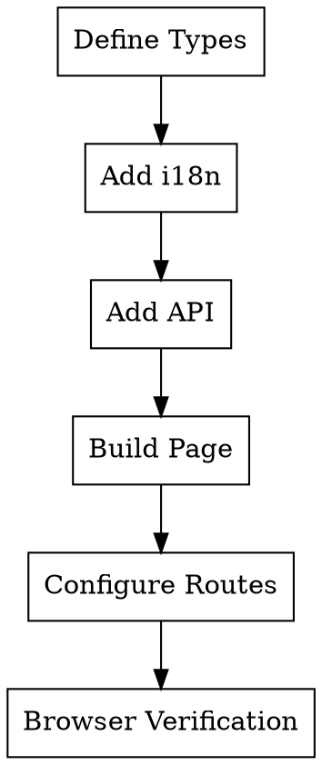

# AMS-AI Frontend Development Conventions

## Overview

Reference implementation: `app-web/src/pages/admin/RoleManagementPage.tsx`

Standard CRUD page features:
- Separate search input state from query state
- Server-side pagination (`page`, `size`, `x-total-count`)
- Dialog-based create/edit with relationship selection

## Development Workflow



## Internationalization (i18n)

**All user-visible text must use i18n**

### Adding Translation Keys

Add keys to both language files:
- `app-web/src/i18n/locales/zh-CN.json`
- `app-web/src/i18n/locales/en-US.json`

```json
{
  "pages": {
    "xManagement": {
      "title": "X Management",
      "searchPlaceholder": "Search by name or code...",
      "addButton": "Add X",
      "columns": {
        "code": "Code",
        "name": "Name",
        "description": "Description",
        "actions": "Actions"
      },
      "dialog": {
        "createTitle": "Create X",
        "editTitle": "Edit X"
      },
      "form": {
        "code": "Code",
        "codePlaceholder": "Please enter code"
      },
      "messages": {
        "createSuccess": "Created successfully",
        "updateSuccess": "Updated successfully",
        "deleteSuccess": "Deleted successfully"
      }
    }
  }
}
```

### Naming Conventions

| Pattern | Example | Description |
|---------|---------|-------------|
| `pages.{pageName}.title` | `pages.roleManagement.title` | Page title |
| `pages.{pageName}.columns.{field}` | `pages.roleManagement.columns.name` | Table columns |
| `pages.{pageName}.form.{field}` | `pages.roleManagement.form.name` | Form labels |
| `pages.{pageName}.dialog.{action}` | `pages.roleManagement.dialog.createTitle` | Dialog titles |
| `pages.{pageName}.messages.{type}` | `pages.roleManagement.messages.createSuccess` | Toast messages |

### Usage

```tsx
import { useTranslation } from 'react-i18next';

const { t } = useTranslation();

// Page title
<CardTitle>{t('pages.xManagement.title')}</CardTitle>

// Input placeholder
<Input placeholder={t('pages.xManagement.searchPlaceholder')} />

// Toast message
toast.success(t('pages.xManagement.messages.createSuccess'));
```

### Predefined Common Keys

Use `common.*` keys for shared elements:
- `common.loading`, `common.submit`, `common.cancel`, `common.confirm`
- `common.save`, `common.delete`, `common.edit`, `common.add`, `common.search`
- `common.loadFailed`, `common.retry` - For error display components

## Type Definitions

Add in `app-web/src/utils/api.ts`:

```typescript
export interface XQueryParams {
  page?: number;  // zero-based for backend
  size?: number;
  keyword?: string;
}

type Id = number | string;

export interface XItem {
  id: Id;
  code: string;
  name: string;
  description?: string;
}

export interface XPayload {
  code: string;
  name: string;
  description?: string;
  relatedIds?: Id[];
}

export interface PageResponse<T> {
  content?: T[];
  items?: T[];
  totalElements?: number;
  totalCount?: number;
}
```

## API Methods

Add in `app-web/src/utils/api.ts`:

```typescript
export const xApi = {
  getList: (params?: XQueryParams) =>
    apiClient.get<PageResponse<XItem>>('/system/x', { params }),
  create: (payload: XPayload) =>
    apiClient.post<XItem>('/system/x', payload),
  update: (id: Id, payload: XPayload) =>
    apiClient.put<XItem>(`/system/x/${id}`, payload),
  delete: (id: Id) =>
    apiClient.delete(`/system/x/${id}`),
};
```

## Form Development Conventions

### shadcn Form Components

The project uses shadcn-style Form components adapted for TanStack Form:

```tsx
import {
  FormItem,
  FormLabel,
  FormControl,
  FormDescription,
  FormMessage,
} from '@/components/ui/form';
```

### Basic Usage

```tsx
<form.Field name="fieldName">
  {(field) => (
    <FormItem>
      <FormLabel required>{t('pages.xxx.form.fieldName')}</FormLabel>
      <FormControl>
        <Input
          value={field.state.value as string}
          onChange={(e) => field.handleChange(e.target.value)}
          onBlur={field.handleBlur}
          required
        />
      </FormControl>
      <FormDescription>Helper text</FormDescription>
      <FormMessage error={error} />
    </FormItem>
  )}
</form.Field>
```

### Required Field Markers

- **Required fields**: Set `<FormLabel required>` to automatically show red asterisk `*`
- Required field inputs should also have the `required` attribute

```tsx
// ✅ Correct
<FormItem>
  <FormLabel required>{t('pages.xxx.form.username')}</FormLabel>
  <FormControl>
    <Input required />
  </FormControl>
</FormItem>

// ❌ Wrong - Do not manually add asterisk
<FormItem>
  <FormLabel>Username*</FormLabel>
  <FormControl>
    <Input required />
  </FormControl>
</FormItem>
```

### Inline Controls (Switch/Checkbox)

```tsx
<FormItem className="flex items-center gap-2 space-y-0">
  <FormControl>
    <Switch checked={value} onCheckedChange={setValue} />
  </FormControl>
  <Label className="cursor-pointer">{t('pages.xxx.form.enabled')}</Label>
</FormItem>
```

### Supported Input Controls

FormControl supports all standard input controls:
- `Input` - Text input
- `Textarea` - Multi-line text
- `Select` - Dropdown selection
- `Switch` - Toggle switch
- `Checkbox` - Checkbox
- Custom components

## Page Component Construction

### 1) State Patterns

```typescript
const [items, setItems] = useState<XItem[]>([]);
const [loading, setLoading] = useState(false);
const [error, setError] = useState<string | null>(null);

// Search: Separate input state from query state
const [searchKeyword, setSearchKeyword] = useState('');
const [queryKeyword, setQueryKeyword] = useState('');

// Pagination: UI uses 1-based
const [currentPage, setCurrentPage] = useState(1);
const [pageSize, setPageSize] = useState(20);
const [total, setTotal] = useState(0);

// Dialog
const [dialogOpen, setDialogOpen] = useState(false);
const [dialogMode, setDialogMode] = useState<'create' | 'edit'>('create');
const [editingItem, setEditingItem] = useState<XItem | null>(null);

// Delete confirmation
const [deleteOpen, setDeleteOpen] = useState(false);
const [deleteItem, setDeleteItem] = useState<XItem | null>(null);
```

### 2) Loading Pattern (Pagination)

```typescript
const loadItems = useCallback(async (
  targetPage = currentPage,
  targetPageSize = pageSize,
  targetKeyword = queryKeyword,
) => {
  setLoading(true);
  setError(null);
  try {
    const params: { page: number; size: number; keyword?: string } = {
      page: Math.max(targetPage - 1, 0),  // Convert to zero-based
      size: targetPageSize,
    };
    if (targetKeyword) params.keyword = targetKeyword;

    const res = await xApi.getList(params);
    const list = Array.isArray(res.data) ? res.data : (res.data.content ?? res.data.items ?? []);

    // Prefer reading total from header
    const totalHeader =
      (res.headers?.['x-total-count'] as string | number | undefined)
      ?? (res.headers?.['X-Total-Count'] as string | number | undefined);

    let totalCount = Number(totalHeader);
    if (Number.isNaN(totalCount)) {
      totalCount = Number(
        !Array.isArray(res.data)
          ? (res.data.totalElements ?? res.data.totalCount ?? list.length)
          : list.length,
      );
    }

    setItems(list);
    setTotal(totalCount);
    return list;
  } catch (err) {
    setError(err instanceof Error ? err.message : 'Load failed');
    return [] as XItem[];
  } finally {
    setLoading(false);
  }
}, [currentPage, pageSize, queryKeyword]);
```

### 3) Search and Reset

```typescript
const handleSearch = () => {
  const keyword = searchKeyword.trim();
  setQueryKeyword(keyword);
  setCurrentPage(1);
};

const handleReset = () => {
  setSearchKeyword('');
  setQueryKeyword('');
  setCurrentPage(1);
};
```

### 4) Relationship Selection (Permissions/Tags)

For role-like pages, use ID arrays to manage selection state:

```typescript
const toggleRelated = (id: Id) => {
  setFormState((prev) => ({
    ...prev,
    relatedIds: (prev.relatedIds ?? []).includes(id)
      ? (prev.relatedIds ?? []).filter((x) => x !== id)
      : [...(prev.relatedIds ?? []), id],
  }));
};
```

## Error Handling with QueryErrorDisplay

Use `QueryErrorDisplay` component for lightweight error feedback that preserves UI structure.

### Component Location

`app-web/src/components/common/QueryErrorDisplay.tsx`

### Sizes

| Size | Use Case | Layout |
|------|----------|--------|
| `inline` | Tables, sidebars | Horizontal bar with retry button |
| `card` | Dashboard cards, management pages | Centered with icon and button |
| `full` | Full-page errors | Large centered display |

### Usage

```tsx
import { QueryErrorDisplay } from '@/components/common/QueryErrorDisplay';

// In data loading component
const [error, setError] = useState<Error | null>(null);

// Display inline (table top)
{error && (
  <QueryErrorDisplay
    error={error}
    onRetry={loadData}
    size="inline"
  />
)}

// Display in card
{error && (
  <QueryErrorDisplay
    error={error}
    onRetry={loadData}
    size="card"
  />
)}
```

### Best Practices

1. **Preserve UI structure** - Don't hide the entire component on error
2. **Show retry option** - Always provide a way to reload data
3. **Use appropriate size** - Match the error display to the container
4. **Integrate with loading state** - Show error when loading=false and error!=null

### Pattern for Page Components

```tsx
// In DataTable wrapper
<DataTable>
  {error && <QueryErrorDisplay error={error} onRetry={loadItems} size="inline" />}
  {!error && <TableContent />}
</DataTable>

// In Card wrapper
<Card>
  <CardHeader>...</CardHeader>
  <CardContent>
    {loading && <LoadingSkeleton />}
    {error && <QueryErrorDisplay error={error} onRetry={loadData} size="card" />}
    {!loading && !error && <Content />}
  </CardContent>
</Card>
```

## UI Structure Standard

1. Search card
2. List card (title + add button + table)
3. Create/edit dialog
4. Delete confirmation dialog
5. Pagination area (below list)

## Route Configuration

Add in `app-web/src/Router.tsx`:

```typescript
import XManagementPage from '@/pages/module/XManagementPage';

<Route path="module/x" element={<XManagementPage />} />
```

## Style Conventions

- Use Tailwind CSS 4
- Form container spacing: `space-y-4`
- Two-column layout: `grid grid-cols-2 gap-4`
- Required asterisk color: `text-destructive`

## Common Mistakes

| Mistake | Correction |
|---------|------------|
| Hardcoded text in components | Use `t('pages.xxx.key')` for all user text |
| Adding key to only one language file | Must add to both `zh-CN.json` and `en-US.json` |
| Using `searchKeyword` directly when loading | Keep `queryKeyword` separate from input state |
| Sending 1-based `page` to backend | Use `Math.max(currentPage - 1, 0)` to convert |
| Ignoring `x-total-count` | Prefer response header, then fallback to body |
| JS long integer precision issues | Use `string` or `number \| string` for ID fields |
| Not handling empty page after delete | Go back one page when current page becomes empty |
| Hiding entire UI on load failure | Use QueryErrorDisplay to preserve structure |
| Missing retry on error states | Always provide onRetry callback for error recovery |

## Verification

```bash
cd app-web && pnpm lint
cd app-web && pnpm build
```

After completion, use the `frontend-ui-verification` skill for browser verification.