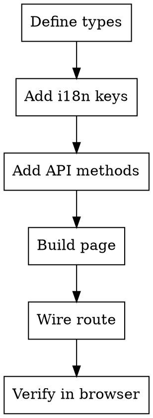

# Frontend Page Development

## Overview

Use `app-web/src/pages/admin/RoleManagementPage.tsx` as the primary reference.

Current standard is not only CRUD layout, but also:
- search input state separated from query state
- server-driven pagination (`page`, `size`, `x-total-count`)
- dialog-based create/edit with permission selection

## Reference Files

- `app-web/src/pages/admin/RoleManagementPage.tsx`
- `app-web/src/utils/api.ts`
- `app-web/src/Router.tsx`

## Workflow



## Internationalization (i18n)

**All user-facing text must be internationalized using react-i18next.**

### Step 0: Add i18n Keys

Add translation keys to both locale files:

**`app-web/src/i18n/locales/zh-CN.json`:**
```json
{
  "pages": {
    "xManagement": {
      "title": "X管理",
      "searchPlaceholder": "搜索名称或编码...",
      "addButton": "新增X",
      "columns": {
        "code": "编码",
        "name": "名称",
        "description": "描述",
        "actions": "操作"
      },
      "dialog": {
        "createTitle": "新增X",
        "editTitle": "编辑X"
      },
      "form": {
        "code": "编码",
        "codePlaceholder": "请输入编码",
        "name": "名称",
        "namePlaceholder": "请输入名称"
      },
      "confirm": {
        "deleteTitle": "确认删除",
        "deleteMessage": "确定要删除该记录吗？"
      },
      "messages": {
        "createSuccess": "创建成功",
        "updateSuccess": "更新成功",
        "deleteSuccess": "删除成功"
      }
    }
  }
}
```

**`app-web/src/i18n/locales/en-US.json`:**
```json
{
  "pages": {
    "xManagement": {
      "title": "X Management",
      "searchPlaceholder": "Search by name or code...",
      "addButton": "Add X",
      "columns": {
        "code": "Code",
        "name": "Name",
        "description": "Description",
        "actions": "Actions"
      },
      "dialog": {
        "createTitle": "Create X",
        "editTitle": "Edit X"
      },
      "form": {
        "code": "Code",
        "codePlaceholder": "Enter code",
        "name": "Name",
        "namePlaceholder": "Enter name"
      },
      "confirm": {
        "deleteTitle": "Confirm Delete",
        "deleteMessage": "Are you sure you want to delete this item?"
      },
      "messages": {
        "createSuccess": "Created successfully",
        "updateSuccess": "Updated successfully",
        "deleteSuccess": "Deleted successfully"
      }
    }
  }
}
```

### Usage in Components

```tsx
import { useTranslation } from 'react-i18next';

export default function XManagementPage() {
  const { t } = useTranslation();

  return (
    <>
      <CardTitle>{t('pages.xManagement.title')}</CardTitle>
      <Input placeholder={t('pages.xManagement.searchPlaceholder')} />
      <Button>{t('pages.xManagement.addButton')}</Button>
      {/* Table columns */}
      <TableHead>{t('pages.xManagement.columns.code')}</TableHead>
      {/* Dialog title */}
      <DialogTitle>
        {dialogMode === 'create' 
          ? t('pages.xManagement.dialog.createTitle')
          : t('pages.xManagement.dialog.editTitle')}
      </DialogTitle>
      {/* Toast messages */}
      toast.success(t('pages.xManagement.messages.createSuccess'));
    </>
  );
}
```

### i18n Key Naming Convention

| Pattern | Example | Description |
|---------|---------|-------------|
| `pages.{pageName}.title` | `pages.roleManagement.title` | Page title |
| `pages.{pageName}.columns.{field}` | `pages.roleManagement.columns.name` | Table columns |
| `pages.{pageName}.form.{field}` | `pages.roleManagement.form.name` | Form labels |
| `pages.{pageName}.dialog.{action}` | `pages.roleManagement.dialog.createTitle` | Dialog titles |
| `pages.{pageName}.messages.{type}` | `pages.roleManagement.messages.createSuccess` | Toast messages |
| `common.{action}` | `common.save`, `common.cancel` | Shared actions |

### Common Keys (Pre-defined)

Use existing `common.*` keys for standard actions:
- `common.loading`, `common.submit`, `common.cancel`, `common.confirm`
- `common.save`, `common.delete`, `common.edit`, `common.add`, `common.search`

## Step 1: Define TypeScript Types

In `app-web/src/utils/api.ts` add:

```typescript
export interface XQueryParams {
  page?: number; // zero-based for backend
  size?: number;
  keyword?: string;
}

type Id = number | string;

export interface XItem {
  id: Id;
  code: string;
  name: string;
  description?: string;
}

export interface XPayload {
  code: string;
  name: string;
  description?: string;
  relatedIds?: Id[];
}

export interface PageResponse<T> {
  content?: T[];
  items?: T[];
  totalElements?: number;
  totalCount?: number;
}
```

## Step 2: Add API Methods

In `app-web/src/utils/api.ts`:

```typescript
export const xApi = {
  getList: (params?: XQueryParams) =>
    apiClient.get<PageResponse<XItem>>('/system/x', { params }),
  create: (payload: XPayload) =>
    apiClient.post<XItem>('/system/x', payload),
  update: (id: Id, payload: XPayload) =>
    apiClient.put<XItem>(`/system/x/${id}`, payload),
  delete: (id: Id) =>
    apiClient.delete(`/system/x/${id}`),
};
```

## Step 3: Build Page Component

Create `app-web/src/pages/{module}/XManagementPage.tsx` and follow this pattern.

### 1) State Pattern

```typescript
const [items, setItems] = useState<XItem[]>([]);
const [loading, setLoading] = useState(false);
const [error, setError] = useState<string | null>(null);

const [searchKeyword, setSearchKeyword] = useState('');
const [queryKeyword, setQueryKeyword] = useState('');

const [currentPage, setCurrentPage] = useState(1); // UI is 1-based
const [pageSize, setPageSize] = useState(20);
const [total, setTotal] = useState(0);

const [dialogOpen, setDialogOpen] = useState(false);
const [dialogMode, setDialogMode] = useState<'create' | 'edit'>('create');
const [editingItem, setEditingItem] = useState<XItem | null>(null);

const [deleteOpen, setDeleteOpen] = useState(false);
const [deleteItem, setDeleteItem] = useState<XItem | null>(null);
```

### 2) Loading Pattern (with pagination)

```typescript
const loadItems = useCallback(async (
  targetPage = currentPage,
  targetPageSize = pageSize,
  targetKeyword = queryKeyword,
) => {
  setLoading(true);
  setError(null);
  try {
    const params: { page: number; size: number; keyword?: string } = {
      page: Math.max(targetPage - 1, 0),
      size: targetPageSize,
    };
    if (targetKeyword) params.keyword = targetKeyword;

    const res = await xApi.getList(params);
    const list = Array.isArray(res.data) ? res.data : (res.data.content ?? res.data.items ?? []);

    const totalHeader =
      (res.headers?.['x-total-count'] as string | number | undefined)
      ?? (res.headers?.['X-Total-Count'] as string | number | undefined);

    let totalCount = Number(totalHeader);
    if (Number.isNaN(totalCount)) {
      totalCount = Number(
        !Array.isArray(res.data)
          ? (res.data.totalElements ?? res.data.totalCount ?? list.length)
          : list.length,
      );
    }

    setItems(list);
    setTotal(totalCount);
    return list;
  } catch (err) {
    setError(err instanceof Error ? err.message : 'Load failed');
    return [] as XItem[];
  } finally {
    setLoading(false);
  }
}, [currentPage, pageSize, queryKeyword]);
```

### 3) Search and Reset Pattern

```typescript
const handleSearch = () => {
  const keyword = searchKeyword.trim();
  setQueryKeyword(keyword);
  setCurrentPage(1);
};

const handleReset = () => {
  setSearchKeyword('');
  setQueryKeyword('');
  setCurrentPage(1);
};
```

### 4) Role-Definition Style Dialog

For role-like pages with relation selection (permissions, tags, scopes):
- keep selection state as an ID list in form state
- use button chips with selected/unselected variants
- toggle by ID

```typescript
const toggleRelated = (id: Id) => {
  setFormState((prev) => ({
    ...prev,
    relatedIds: (prev.relatedIds ?? []).includes(id)
      ? (prev.relatedIds ?? []).filter((x) => x !== id)
      : [...(prev.relatedIds ?? []), id],
  }));
};
```

## Step 4: Wire Route

In `app-web/src/Router.tsx`:

```typescript
import XManagementPage from '@/pages/module/XManagementPage';

<Route path="module/x" element={<XManagementPage />} />
```

## UI Structure Standard

1. Search card
2. List card (title + add button + table)
3. Create/Edit dialog
4. Delete confirm dialog
5. Pagination area in list footer

## Common Mistakes

| Mistake | Fix |
|---------|-----|
| Hardcoding Chinese text in components | Use `t('pages.xxx.key')` for all user-facing text |
| Missing i18n keys in one locale file | Add keys to BOTH `zh-CN.json` AND `en-US.json` |
| Using `searchKeyword` directly in loading request | Keep `queryKeyword` separate from input state |
| Sending 1-based `page` to backend | Convert to zero-based with `Math.max(currentPage - 1, 0)` |
| Ignoring `x-total-count` | Read response headers first, then fallback to body |
| Long IDs precision issues in JS | Use `string` or `number | string` for ID fields |
| Reload after delete does not handle empty page | If current page becomes empty, move back one page |

## Verification

```bash
cd app-web && pnpm lint
cd app-web && pnpm build
```

Then run browser checks with `frontend-ui-verification` skill.
