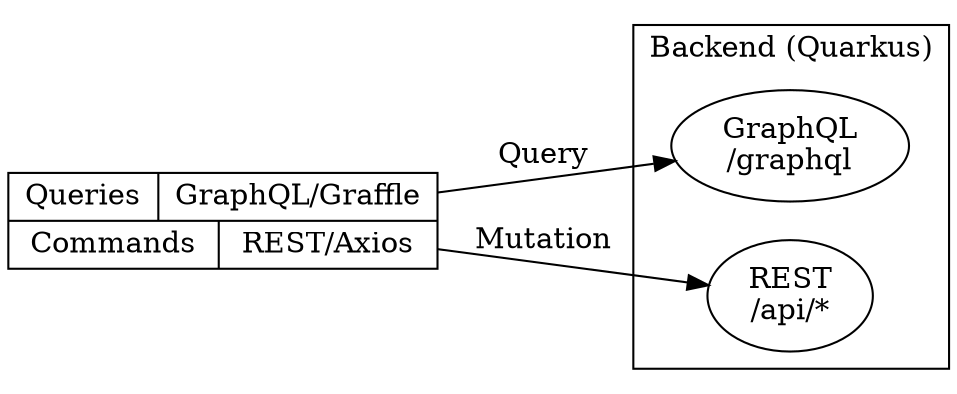

# GraphQL + REST Hybrid API Architecture

## Overview

AMS-AI uses a hybrid approach:
- **Queries (READ)** → GraphQL via Graffle client
- **Commands (WRITE)** → REST via Axios

This combines GraphQL's type-safe queries with REST's simplicity for mutations.

## Architecture



## File Organization

```
app-web/src/
├── lib/
│   ├── graffleClient.ts      # GraphQL client configuration
│   ├── graffle/               # Generated Graffle code (committed)
│   └── queryKeys.ts           # TanStack Query key factory
│
├── schema.graphql             # GraphQL schema (for codegen)
├── graffle.config.ts          # Graffle generator config
│
└── features/admin/{module}/
    ├── queries.ts             # GraphQL queries → TanStack Query
    └── mutations.ts           # REST mutations → TanStack Mutation hooks

feature-graphql/src/main/java/pro/walkin/ams/graphql/
├── connection/                # Connection types (pagination)
│   ├── UserConnection.java
│   └── ...
├── entity/{module}/
│   ├── XGraphQLApi.java       # Query resolver
│   ├── XFilterInput.java      # Filter input type
│   └── XCriteriaTranslator.java
└── filter/
    ├── CriteriaFilterHelper.java
    └── input/                 # Filter input types
```

## GraphQL Queries

### Backend Implementation

1. **Connection Type** (pagination response):

```java
// feature-graphql/.../connection/XConnection.java
package pro.walkin.ams.graphql.connection;

import java.util.List;

public class XConnection<T> {
    public List<T> content;
    public long totalElements;
    public int totalPages;
    public int page;
    public int size;

    public XConnection(List<T> content, long total, int page, int size) {
        this.content = content;
        this.totalElements = total;
        this.page = page;
        this.size = size;
        this.totalPages = (int) Math.ceil((double) total / size);
    }
}
```

2. **Filter Input**:

```java
// feature-graphql/.../entity/x/XFilterInput.java
package pro.walkin.ams.graphql.entity.x;

import org.eclipse.microprofile.graphql.Input;
import pro.walkin.ams.graphql.filter.input.StringFilterInput;
import pro.walkin.ams.graphql.filter.input.LongFilterInput;
import java.util.List;

@Input("XFilter")
public class XFilterInput {
    public List<XFilterInput> _and;
    public List<XFilterInput> _or;
    public LongFilterInput id;
    public StringFilterInput name;
    public StringFilterInput code;
}
```

3. **Criteria Translator**:

```java
// feature-graphql/.../entity/x/XCriteriaTranslator.java
public final class XCriteriaTranslator {
    public static CriteriaQuery<X> translate(
            CriteriaBuilder builder, XFilterInput filter, List<OrderByInput> orderBy) {
        CriteriaQuery<X> query = builder.createQuery(X.class);
        Root<X> root = query.from(X.class);
        
        CriteriaQueryContext<X> ctx = new CriteriaQueryContext<>(builder, query, root);
        
        if (filter != null) {
            CriteriaFilterHelper.addStringPredicate(builder, root, "name", filter.name, predicates);
            CriteriaFilterHelper.addLongPredicate(builder, root, "id", filter.id, predicates);
        }
        
        CriteriaFilterHelper.applyOrderBy(builder, query, root, orderBy);
        return ctx.build();
    }
}
```

4. **GraphQL API**:

```java
// feature-graphql/.../entity/x/XGraphQLApi.java
@GraphQLApi
public class XGraphQLApi {
    @Inject Session session;

    @Query("xs")
    @Description("Query X list with filtering and pagination")
    @Transactional
    public XConnection xs(
            @Name("where") XFilterInput where,
            @Name("orderBy") List<OrderByInput> orderBy,
            @DefaultValue("0") @Name("page") int page,
            @DefaultValue("20") @Name("size") int size) {

        CriteriaBuilder builder = session.getCriteriaBuilder();
        CriteriaQuery<X> query = XCriteriaTranslator.translate(builder, where, orderBy);
        List<X> items = session.createQuery(query)
                .setFirstResult(page * size)
                .setMaxResults(size)
                .getResultList();

        CriteriaQuery<Long> countQuery = XCriteriaTranslator.translateCount(builder, where);
        long total = session.createQuery(countQuery).getSingleResult();

        return new XConnection(items, total, page, size);
    }
}
```

### Frontend Query Implementation

1. **Update Schema** (`schema.graphql`):

```graphql
type Query {
  xs(where: XFilter, orderBy: [OrderByInput], page: Int = 0, size: Int = 20): XConnection!
}

type XConnection {
  content: [X!]!
  totalElements: Long!
  totalPages: Int!
  page: Int!
  size: Int!
}

type X {
  id: String!
  name: String!
  code: String!
}

input XFilter {
  _and: [XFilter!]
  _or: [XFilter!]
  id: LongFilter
  name: StringFilter
  code: StringFilter
}
```

2. **Generate Code**:

```bash
cd app-web && pnpm codegen
```

3. **Create Query** (`queries.ts`):

```typescript
// features/admin/x/queries.ts
import type { QueryClient } from '@tanstack/react-query';
import type { QueryParams, PageResponse } from '@/types/table';
import { queryKeys } from '@/lib/queryKeys';
import { graffle } from '@/lib/graffleClient';
import { type XItem } from '@/utils/api';

export async function fetchXsPage(
    params: QueryParams,
    searchParams: Record<string, string>,
): Promise<PageResponse<XItem>> {
    const page = params.page ?? 0;
    const size = params.size ?? 20;

    const where = buildFilter(searchParams);
    const orderBy = buildOrderBy(params);

    const result = await graffle.query.xs({
        $: { where, orderBy, page, size },
        content: {
            id: true,
            name: true,
            code: true,
        },
        totalElements: true,
        totalPages: true,
        page: true,
        size: true,
    });

    return {
        content: result.content as XItem[],
        totalElements: result.totalElements,
        totalPages: result.totalPages,
        size: result.size,
        number: result.page,
    };
}

function buildFilter(searchParams: Record<string, string>) {
    const filter: Record<string, unknown> = {};
    if (searchParams.name) {
        filter.name = { _ilike: searchParams.name };
    }
    return Object.keys(filter).length > 0 ? filter : undefined;
}

function buildOrderBy(params: QueryParams) {
    if (params.sortBy) {
        return [{ field: params.sortBy, direction: params.sortOrder ?? 'ASC' }];
    }
    return undefined;
}

export function invalidateXList(queryClient: QueryClient) {
    return queryClient.invalidateQueries({ queryKey: queryKeys.xs.listRoot() });
}
```

## REST Mutations

### Frontend Mutation Implementation

```typescript
// features/admin/x/mutations.ts
import { useMutation, useQueryClient, type UseMutationOptions } from '@tanstack/react-query';
import { systemApi, type XPayload, type XItem } from '@/utils/api';
import { queryKeys } from '@/lib/queryKeys';

export function useCreateX(options?: UseMutationOptions<XItem, Error, XPayload>) {
    const queryClient = useQueryClient();

    return useMutation({
        mutationFn: async (payload: XPayload) => {
            const res = await systemApi.createX(payload);
            return res.data;
        },
        onSuccess: () => {
            queryClient.invalidateQueries({ queryKey: queryKeys.xs.listRoot() });
        },
        ...options,
    });
}

export function useUpdateX(options?: UseMutationOptions<XItem, Error, { id: string; payload: XPayload }>) {
    const queryClient = useQueryClient();

    return useMutation({
        mutationFn: async ({ id, payload }: { id: string; payload: XPayload }) => {
            const res = await systemApi.updateX(id, payload);
            return res.data;
        },
        onSuccess: (_, { id }) => {
            queryClient.invalidateQueries({ queryKey: queryKeys.xs.listRoot() });
            queryClient.invalidateQueries({ queryKey: queryKeys.xs.detail(id) });
        },
        ...options,
    });
}

export function useDeleteX(options?: UseMutationOptions<void, Error, string>) {
    const queryClient = useQueryClient();

    return useMutation({
        mutationFn: async (id: string) => {
            await systemApi.deleteX(id);
        },
        onSuccess: () => {
            queryClient.invalidateQueries({ queryKey: queryKeys.xs.listRoot() });
        },
        ...options,
    });
}
```

### Using Mutations in Hooks

```typescript
// features/admin/x/hooks/useXForm.ts
import { useCreateX, useUpdateX } from '../mutations';

export function useXForm() {
    const createMutation = useCreateX();
    const updateMutation = useUpdateX();

    const form = useForm({
        onSubmit: async ({ value }) => {
            if (dialogMode === 'create') {
                await createMutation.mutateAsync(value);
            } else if (editingItem) {
                await updateMutation.mutateAsync({ id: editingItem.id, payload: value });
            }
            closeDialog();
        },
    });

    return {
        form,
        isSubmitting: createMutation.isPending || updateMutation.isPending,
    };
}
```

## Filter Input Types

| Type | Fields | Use Case |
|------|--------|----------|
| `StringFilter` | `_eq`, `_neq`, `_like`, `_ilike`, `_startsWith`, `_endsWith`, `_in`, `_nin`, `_isNull` | Text fields |
| `LongFilter` | `_eq`, `_neq`, `_gt`, `_gte`, `_lt`, `_lte`, `_in`, `_nin`, `_isNull` | ID fields |
| `IntFilter` | `_eq`, `_neq`, `_gt`, `_gte`, `_lt`, `_lte`, `_in`, `_nin`, `_isNull` | Integer fields |
| `BooleanFilter` | `_eq`, `_neq`, `_isNull` | Boolean fields |
| `EnumFilter` | `_eq`, `_neq`, `_in`, `_nin`, `_isNull` | Enum fields |
| `DateTimeFilter` | `_eq`, `_neq`, `_gt`, `_gte`, `_lt`, `_lte`, `_isNull` | Date/time fields |

## CriteriaFilterHelper Methods

```java
// Static filter methods
translateStringFilter(builder, path, filter)
translateLongFilter(builder, path, filter)
translateIntFilter(builder, path, filter)
translateBooleanFilter(builder, path, filter)
translateEnumFilter(builder, path, filter)
translateLocalDateTimeFilter(builder, path, filter)

// Predicate builders (add to existing list)
addStringPredicate(builder, root, fieldName, filter, predicates)
addLongPredicate(builder, root, fieldName, filter, predicates)
addIntPredicate(builder, root, fieldName, filter, predicates)
addBooleanPredicate(builder, root, fieldName, filter, predicates)
addEnumPredicate(builder, root, fieldName, filter, predicates)

// OrderBy helper
applyOrderBy(builder, query, root, orderBy)
```

## Query Keys Pattern

```typescript
// lib/queryKeys.ts
export const queryKeys = {
    xs: {
        root: () => ['xs'],
        listRoot: () => ['xs', 'list'],
        list: (params: unknown) => ['xs', 'list', params],
        detail: (id: string) => ['xs', 'detail', String(id)],
    },
};
```

## Common Patterns

### Nested Enums (Avoid Direct Exposure)

SmallRye GraphQL has issues with nested enum types like `Constants.Alarm.Severity`.

**Solution**: Use DTOs with String types:

```java
// Instead of exposing entity directly
public class AlarmDTO {
    public String severity;  // NOT Constants.Alarm.Severity
    public String status;    // NOT Constants.Alarm.Status
}
```

### Sub-resource Queries

For sub-resources (like Permissions under Menus), can keep REST:

```typescript
// Acceptable: Sub-resource still using REST
export function fetchMenuPermissions(queryClient: QueryClient, menuId: string) {
    return queryClient.fetchQuery({
        queryKey: queryKeys.menus.permissions(menuId),
        queryFn: async () => {
            const res = await menuApi.getMenuPermissions(menuId);
            return res.data;
        },
    });
}
```

### Error Handling

Mutations return typed errors:

```typescript
const deleteMutation = useDeleteX();

// Access error
if (deleteMutation.error) {
    showToast(deleteMutation.error.message);
}

// In handler
try {
    await deleteMutation.mutateAsync(id);
} catch {
    // Error already handled by mutation
}
```

## Commands Reference

```bash
# Generate Graffle code from schema
cd app-web && pnpm codegen

# Compile backend GraphQL module
./gradlew :feature-graphql:compileJava

# Full build
./gradlew build -x test
```

## Checklist for New Module

- [ ] Backend: Create Connection type
- [ ] Backend: Create FilterInput
- [ ] Backend: Create CriteriaTranslator
- [ ] Backend: Create GraphQLApi with @Query
- [ ] Frontend: Add to schema.graphql
- [ ] Frontend: Run `pnpm codegen`
- [ ] Frontend: Create queries.ts with fetch function
- [ ] Frontend: Create mutations.ts with hooks
- [ ] Frontend: Update hooks to use mutations
- [ ] Frontend: Add queryKeys to lib/queryKeys.ts
- [ ] Verify: Backend compiles
- [ ] Verify: Frontend TypeScript passes
