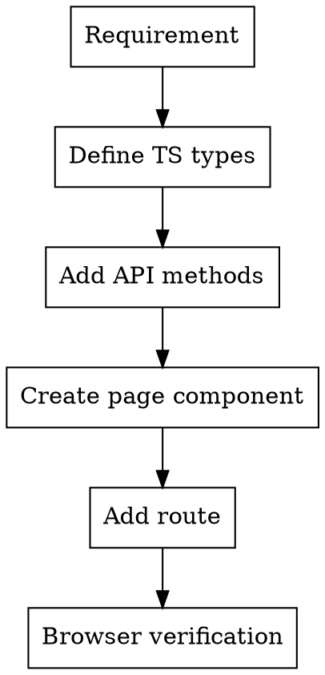

# Frontend Page Development

## Overview

**Follow the RoleManagementPage pattern for consistency.** Standard CRUD pages = Search section + List section + Dialogs.

## Reference Implementation

`app-web/src/pages/admin/RoleManagementPage.tsx` - Standard CRUD management page template

## Workflow



## Step 1: TypeScript Types

Add to `app-web/src/utils/api.ts`:

```typescript
// Query params
export interface XQueryParams {
    page?: number;
    size?: number;
    keyword?: string;
}

// Entity
export interface XItem {
    id: number;
    name: string;
    status: string;
    createdAt?: string;
}

// Payloads
export interface XCreatePayload {
    name: string;
    status: string;
}

export interface XUpdatePayload {
    name?: string;
    status?: string;
}

// Page response (already exists)
export interface PageResponse<T> {
    content?: T[];
    items?: T[];
    totalElements?: number;
    totalCount?: number;
}
```

## Step 2: API Methods

Add to `app-web/src/utils/api.ts`:

```typescript
export const xApi = {
    getList: (params?: XQueryParams) => 
        apiClient.get<PageResponse<XItem>>('/system/x', {params}),
    getById: (id: number) => 
        apiClient.get<XItem>(`/system/x/${id}`),
    create: (payload: XCreatePayload) => 
        apiClient.post<XItem>('/system/x', payload),
    update: (id: number, payload: XUpdatePayload) => 
        apiClient.put<XItem>(`/system/x/${id}`, payload),
    delete: (id: number) => 
        apiClient.delete(`/system/x/${id}`),
};
```

## Step 3: Page Component

Create in `app-web/src/pages/{module}/XManagementPage.tsx`:

### Imports
```typescript
import { useCallback, useEffect, useState } from 'react';
import { Pencil, Plus, RotateCcw, Search, Trash2 } from 'lucide-react';
import { Card, CardContent, CardDescription, CardHeader, CardTitle } from '@/components/ui/card';
import { Button } from '@/components/ui/button';
import { Input } from '@/components/ui/input';
import { Label } from '@/components/ui/label';
import { Badge } from '@/components/ui/badge';
import { Skeleton } from '@/components/ui/skeleton';
import { Alert, AlertDescription } from '@/components/ui/alert';
import {
    Dialog, DialogContent, DialogDescription, DialogFooter,
    DialogHeader, DialogTitle,
} from '@/components/ui/dialog';
import {
    Table, TableBody, TableCell, TableHead, TableHeader, TableRow,
} from '@/components/ui/table';
import { xApi, type XItem, type XCreatePayload } from '@/utils/api';
```

### Page Structure (Reference: RoleManagementPage)
```typescript
export default function XManagementPage() {
    // 1. Data state
    const [items, setItems] = useState<XItem[]>([]);
    const [loading, setLoading] = useState(false);
    const [error, setError] = useState<string | null>(null);
    const [searchKeyword, setSearchKeyword] = useState('');

    // 2. Form dialog state
    const [dialogOpen, setDialogOpen] = useState(false);
    const [dialogMode, setDialogMode] = useState<'create' | 'edit'>('create');
    const [editingItem, setEditingItem] = useState<XItem | null>(null);
    const [formState, setFormState] = useState<FormState>(initialFormState);
    const [formLoading, setFormLoading] = useState(false);
    const [formError, setFormError] = useState<string | null>(null);

    // 3. Delete confirmation state
    const [deleteOpen, setDeleteOpen] = useState(false);
    const [deleteItem, setDeleteItem] = useState<XItem | null>(null);
    const [deleteLoading, setDeleteLoading] = useState(false);

    // 4. Data loading
    const loadItems = useCallback(async () => {
        setLoading(true);
        setError(null);
        try {
            const params = searchKeyword ? { keyword: searchKeyword } : undefined;
            const res = await xApi.getList(params);
            const list = Array.isArray(res.data) ? res.data : (res.data.content ?? res.data.items ?? []);
            setItems(list);
        } catch (err) {
            setError(err instanceof Error ? err.message : 'Load failed');
        } finally {
            setLoading(false);
        }
    }, [searchKeyword]);

    useEffect(() => {
        void loadItems();
    }, [loadItems]);

    // 5. Search/Reset handlers
    const handleSearch = () => void loadItems();
    const handleReset = () => {
        setSearchKeyword('');
        setItems([]);
        setTimeout(() => void loadItems(), 0);
    };

    // 6. Dialog operations
    const openCreateDialog = () => { /* ... */ };
    const openEditDialog = (item: XItem) => { /* ... */ };
    const closeDialog = () => { /* ... */ };

    // 7. Form submit
    const handleFormSubmit = async (e: React.FormEvent) => {
        e.preventDefault();
        setFormLoading(true);
        setFormError(null);
        try {
            if (dialogMode === 'create') {
                await xApi.create(formState);
            } else if (editingItem) {
                await xApi.update(editingItem.id, formState);
            }
            closeDialog();
            void loadItems();
        } catch (err) {
            setFormError(err instanceof Error ? err.message : 'Operation failed');
        } finally {
            setFormLoading(false);
        }
    };

    // 8. Delete operation
    const handleDelete = async () => { /* ... */ };

    return (
        <div className="space-y-6">
            {/* Search Card */}
            <Card>
                <CardHeader>
                    <CardTitle>X Management</CardTitle>
                    <CardDescription>Description</CardDescription>
                </CardHeader>
                <CardContent className="space-y-4">
                    <div className="flex flex-wrap gap-4 items-end">
                        <div className="flex-1 min-w-[200px] space-y-2">
                            <Label>Keyword</Label>
                            <Input ... />
                        </div>
                        <Button onClick={handleSearch}>Search</Button>
                        <Button variant="outline" onClick={handleReset}>Reset</Button>
                    </div>
                </CardContent>
            </Card>

            {/* List Card */}
            <Card>
                <CardHeader className="flex flex-row items-center justify-between">
                    <CardTitle>List</CardTitle>
                    <Button onClick={openCreateDialog}>Add</Button>
                </CardHeader>
                <CardContent>
                    {/* error, loading, table */}
                </CardContent>
            </Card>

            {/* Form Dialog */}
            <Dialog open={dialogOpen} onOpenChange={setDialogOpen}>
                <DialogContent>
                    <form onSubmit={handleFormSubmit}>...</form>
                </DialogContent>
            </Dialog>

            {/* Delete Confirmation Dialog */}
            <Dialog open={deleteOpen} onOpenChange={setDeleteOpen}>...</Dialog>
        </div>
    );
}
```

## Step 4: Route

Add to `app-web/src/Router.tsx`:

```typescript
import XManagementPage from '@/pages/module/XManagementPage';

// In ProtectedRoute children:
<Route path="module/x" element={<XManagementPage />} />
```

## Quick Reference

| File | Purpose |
|------|---------|
| `utils/api.ts` | Type definitions + API methods |
| `pages/{module}/` | Page components |
| `Router.tsx` | Route configuration |
| `components/ui/` | UI component library |

## Common Mistakes

| Mistake | Fix |
|---------|-----|
| Direct async call in useEffect | `useEffect(() => { void loadItems(); }, [])` |
| Not using useCallback | Wrap data loading function in `useCallback` |
| Forgetting error reset | `setError(null)` at start of loading |
| Incomplete response handling | `Array.isArray(res.data) ? res.data : (res.data.content ?? res.data.items ?? [])` |

## Red Flags

- "This page is different" - Reference RoleManagementPage pattern first
- "Need new state management" - useState is sufficient
- "Skip the dialog" - Always use Dialog component for consistency

## Verification

```bash
cd app-web && pnpm lint      # No errors
cd app-web && pnpm build     # Build success
```

Then use `frontend-ui-verification` skill for browser testing.
