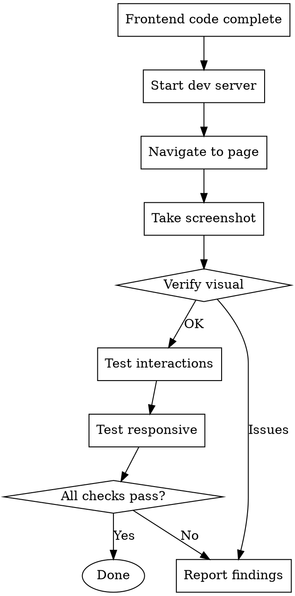

# Frontend UI Verification

## Overview

**MUST verify UI in browser before claiming frontend work is complete.** Code compiles ≠ UI works correctly.

## When to Use

- Creating new page/component
- Modifying styles or layout
- Adding UI interactions
- Fixing UI bugs
- Before committing frontend changes

## Workflow



## Quick Reference

| Task | Tool |
|------|------|
| List pages | `chrome-devtools_list_pages` |
| Navigate | `chrome-devtools_navigate_page` |
| Snapshot | `chrome-devtools_take_snapshot` |
| Screenshot | `chrome-devtools_take_screenshot` |
| Click | `chrome-devtools_click` |
| Fill form | `chrome-devtools_fill` |
| Resize | `chrome-devtools_resize_page` |
| Emulate mobile | `chrome-devtools_emulate` |

## Verification Checklist

1. **Page loads** - No console errors
2. **Layout correct** - Screenshot and verify
3. **Interactions work** - Click, fill, submit
4. **Responsive** - Test mobile/tablet sizes
5. **Accessibility** - Check snapshot structure

## Common Patterns

### Start Dev Server & Open Page
```
1. cd app-web && pnpm dev
2. Wait for server ready
3. chrome-devtools_new_page url="http://localhost:5173/page-path"
```

### Take Screenshot for Verification
```
chrome-devtools_take_screenshot format="png"
```

### Test Responsive Design
```
chrome-devtools_resize_page width=375 height=667   # Mobile
chrome-devtools_resize_page width=768 height=1024  # Tablet
chrome-devtools_resize_page width=1920 height=1080 # Desktop
```

### Check Console for Errors
```
chrome-devtools_list_console_messages types=["error", "warn"]
```

## Anti-Patterns

- Claiming "UI looks good" without screenshot
- Skipping mobile/tablet testing
- Ignoring console errors/warnings
- Only testing happy path interactions

## Red Flags

- "The code looks correct"
- "It compiled without errors"
- "Similar to existing component"
- "Just a small style change"

**All of these require browser verification anyway.**
