# AMS 告警管理系统 - 数据库ERD设计

## 架构概览

```
┌─────────────────────────────────────────────────────────────────────────────┐
│                           AMS 数据库三层架构                                  │
├─────────────────────────────────────────────────────────────────────────────┤
│                                                                             │
│  ┌─────────────────────┐  ┌─────────────────────┐  ┌─────────────────────┐ │
│  │   基础设施层         │  │   业务建模层         │  │   活动信息层         │ │
│  │   (Foundation)      │  │   (Business)        │  │   (Activity)        │ │
│  │                     │  │                     │  │                     │ │
│  │  • tenants          │  │  • fab_equipments   │  │  • alarms           │ │
│  │  • users            │◄─┤  • alarm_rules      │◄─┤  • alarm_events     │ │
│  │  • alert_sources    │  │  • alarm_policies   │  │  • notifications    │ │
│  │  • label_mappings   │  │  • notification_*   │  │  • ai_analysis_*    │ │
│  │                     │  │                     │  │  • audit_logs       │ │
│  └─────────────────────┘  └─────────────────────┘  └─────────────────────┘ │
│           │                        │                        │              │
│           ▼                        ▼                        ▼              │
│     变化频率低                相对稳定                  高吞吐动态数据        │
│     配置数据                  可配置规则                支持归档清理          │
│                                                                             │
└─────────────────────────────────────────────────────────────────────────────┘
```

---

## 第一层：基础设施层 (Foundation Layer)

### 1.1 租户管理


**tenants 表 - 租户/业务线**

| 字段 | 类型 | 说明 |
|------|------|------|
| id | BIGSERIAL | 主键 |
| code | VARCHAR(64) | 租户唯一编码，如：fab_a, it_ops |
| name | VARCHAR(128) | 租户名称 |
| type | VARCHAR(32) | 类型：FAB(晶圆厂)/IT(运维)/OTHER |
| status | VARCHAR(16) | 状态：ACTIVE/SUSPENDED/ARCHIVED |
| config | JSONB | 租户级配置：告警保留天数、时区等 |
| quota | JSONB | 配额：告警数上限、用户数上限等 |

---

### 1.2 用户与权限


**users 表 - 用户**

| 字段 | 类型 | 说明 |
|------|------|------|
| id | BIGSERIAL | 主键 |
| tenant_id | BIGINT | 所属租户ID |
| username | VARCHAR(64) | 用户名（租户内唯一） |
| email | VARCHAR(128) | 邮箱（租户内唯一） |
| role | VARCHAR(32) | 角色：ADMIN/MANAGER/OPERATOR/VIEWER |
| status | VARCHAR(16) | 状态：ACTIVE/SUSPENDED/LOCKED |
| preferences | JSONB | 个人偏好配置 |

**user_notification_prefs 表 - 用户通知偏好**

| 字段 | 类型 | 说明 |
|------|------|------|
| id | BIGSERIAL | 主键 |
| user_id | BIGINT | 用户ID |
| channel_type | VARCHAR(32) | 渠道类型：EMAIL/SMS/DINGTALK等 |
| config | JSONB | 渠道配置：邮箱地址、手机号等 |
| is_enabled | BOOLEAN | 是否启用 |
| work_hours_only | BOOLEAN | 仅工作时间通知 |

---

### 1.3 系统配置


**alert_sources 表 - 告警来源配置**

| 字段 | 类型 | 说明 |
|------|------|------|
| id | BIGSERIAL | 主键 |
| tenant_id | BIGINT | 所属租户ID（NULL为系统级） |
| name | VARCHAR(128) | 来源名称 |
| protocol | VARCHAR(32) | 协议：HTTP/KAFKA/RABBITMQ/TCP/GRPC |
| auth_type | VARCHAR(32) | 认证类型：NONE/API_KEY/OAUTH2/CERT |
| auth_config | JSONB | 认证配置 |
| connection_config | JSONB | 连接配置 |
| transform_script | TEXT | 消息转换脚本 |

**label_mappings 表 - 标签映射规则**

| 字段 | 类型 | 说明 |
|------|------|------|
| id | BIGSERIAL | 主键 |
| tenant_id | BIGINT | 所属租户ID |
| source_type | VARCHAR(64) | 来源标识 |
| source_key | VARCHAR(128) | 原始字段名 |
| target_key | VARCHAR(128) | 标准化字段名 |
| transform_rule | JSONB | 转换规则 |
| priority | INT | 优先级 |

---

## 第二层：业务建模层 (Business Modeling Layer)

### 2.1 设备资产（半导体Fab场景）


**fab_equipments 表 - 晶圆厂设备资产**

| 字段 | 类型 | 说明 |
|------|------|------|
| id | BIGSERIAL | 主键 |
| tenant_id | BIGINT | 所属租户ID |
| equipment_id | VARCHAR(64) | 设备唯一编号（租户内唯一） |
| equipment_name | VARCHAR(256) | 设备名称 |
| equipment_type | VARCHAR(64) | 类型：LITHOGRAPHY/ETCH/DEPOSITION等 |
| fab_area | VARCHAR(64) | 厂区/Area |
| bay | VARCHAR(64) | 区域/Bay |
| zone | VARCHAR(64) | 分区/Zone |
| status | VARCHAR(16) | 状态：ACTIVE/MAINTENANCE/RETIRED |
| eap_config | JSONB | EAP连接配置 |
| metadata | JSONB | 扩展属性 |

**fab_equipment_components 表 - 设备组件**

| 字段 | 类型 | 说明 |
|------|------|------|
| id | BIGSERIAL | 主键 |
| tenant_id | BIGINT | 所属租户ID |
| equipment_id | BIGINT | 所属设备ID |
| component_code | VARCHAR(64) | 组件编码 |
| component_name | VARCHAR(128) | 组件名称 |
| component_type | VARCHAR(64) | 类型：CHAMBER/ROBOT/PUMP/RF等 |
| parent_component_id | BIGINT | 上级组件ID（自关联） |

---

### 2.2 告警规则与策略


**alarm_rules 表 - 告警规则**

| 字段 | 类型 | 说明 |
|------|------|------|
| id | BIGSERIAL | 主键 |
| tenant_id | BIGINT | 所属租户ID |
| rule_code | VARCHAR(64) | 规则编码（租户内唯一） |
| rule_name | VARCHAR(128) | 规则名称 |
| rule_type | VARCHAR(32) | 类型：THRESHOLD/PATTERN/ANOMALY/CORRELATION |
| match_conditions | JSONB | 匹配条件 |
| actions | JSONB | 触发动作 |
| dedup_config | JSONB | 去重配置 |
| priority | INT | 优先级 |
| enabled | BOOLEAN | 是否启用 |
| version | INT | 乐观锁版本 |

**alarm_policies 表 - 告警策略**

| 字段 | 类型 | 说明 |
|------|------|------|
| id | BIGSERIAL | 主键 |
| tenant_id | BIGINT | 所属租户ID |
| policy_name | VARCHAR(128) | 策略名称 |
| policy_type | VARCHAR(32) | 类型：ROUTING/ESCALATION/SUPPRESSION/AGGREGATION |
| conditions | JSONB | 适用条件 |
| actions | JSONB | 策略动作 |
| priority | INT | 优先级 |
| execution_order | INT | 执行顺序 |

---

### 2.3 通知配置

```mermaid
erDiagram
    notification_channels ||--o{ notifications : uses
    notification_templates ||--o{ notifications : uses

    notification_channels {
        bigint id PK
        bigint tenant_id FK
        varchar channel_name
        varchar channel_type
        jsonb config
        jsonb auth_config
        jsonb rate_limit
        jsonb retry_policy
        boolean enabled
        int priority
        timestamptz created_at
        timestamptz updated_at
    }

    notification_templates {
        bigint id PK
        bigint tenant_id FK
        varchar template_name
        varchar channel_type
        varchar subject_template
        text body_template
        varchar content_type
        jsonb variables
        varchar locale
        boolean enabled
        timestamptz created_at
        timestamptz updated_at
    }
```



**notification_channels 表 - 通知渠道**

| 字段 | 类型 | 说明 |
|------|------|------|
| id | BIGSERIAL | 主键 |
| tenant_id | BIGINT | 所属租户ID |
| channel_name | VARCHAR(128) | 渠道名称 |
| channel_type | VARCHAR(32) | 类型：EMAIL/SMS/DINGTALK/WECHAT/SLACK/WEBHOOK |
| config | JSONB | 渠道配置 |
| auth_config | JSONB | 认证信息（加密存储） |
| rate_limit | JSONB | 限流配置 |
| retry_policy | JSONB | 重试策略 |

**notification_templates 表 - 通知模板**

| 字段 | 类型 | 说明 |
|------|------|------|
| id | BIGSERIAL | 主键 |
| tenant_id | BIGINT | 所属租户ID |
| template_name | VARCHAR(128) | 模板名称 |
| channel_type | VARCHAR(32) | 适用渠道类型 |
| subject_template | VARCHAR(256) | 标题模板 |
| body_template | TEXT | 内容模板 |
| content_type | VARCHAR(32) | 内容类型：TEXT/HTML/MARKDOWN |
| variables | JSONB | 可用变量说明 |
| locale | VARCHAR(16) | 语言区域 |

---

## 第三层：活动信息层 (Activity Layer)

### 3.1 告警核心


**alarms 表 - 告警主表**

| 字段 | 类型 | 说明 |
|------|------|------|
| id | BIGSERIAL | 主键 |
| tenant_id | BIGINT | 所属租户ID |
| alarm_uid | VARCHAR(64) | 全局唯一告警ID |
| fingerprint | VARCHAR(256) | 去重指纹 |
| title | VARCHAR(512) | 告警标题 |
| description | TEXT | 详细描述 |
| severity | VARCHAR(16) | 严重级别：CRITICAL/ERROR/WARNING/INFO |
| status | VARCHAR(16) | 状态：NEW/ACK/IN_PROGRESS/RESOLVED/CLOSED |
| source_type | VARCHAR(64) | 告警来源类型 |
| source_id | VARCHAR(128) | 来源系统标识 |
| equipment_id | BIGINT | 关联设备ID |
| component_id | BIGINT | 关联组件ID |
| labels | JSONB | 标签集合 |
| metadata | JSONB | 原始告警数据 |
| occurred_at | TIMESTAMPTZ | 发生时间 |
| acknowledged_at | TIMESTAMPTZ | 确认时间 |
| resolved_at | TIMESTAMPTZ | 解决时间 |
| closed_at | TIMESTAMPTZ | 关闭时间 |
| acknowledged_by | BIGINT | 确认人ID |
| resolved_by | BIGINT | 解决人ID |
| lifecycle_state | VARCHAR(32) | 生命周期状态：ACTIVE/ARCHIVED/DELETED |
| retention_until | DATE | 保留截止日期 |

---

### 3.2 告警关联数据


**alarm_events 表 - 告警事件流**

| 字段 | 类型 | 说明 |
|------|------|------|
| id | BIGSERIAL | 主键 |
| tenant_id | BIGINT | 所属租户ID |
| alarm_id | BIGINT | 告警ID |
| event_type | VARCHAR(32) | 事件类型：STATUS_CHANGE/ASSIGN/ESCALATE/COMMENT |
| event_data | JSONB | 事件详情 |
| triggered_by | BIGINT | 触发者ID |
| triggered_via | VARCHAR(32) | 触发方式：UI/API/SYSTEM/RULE |

**alarm_comments 表 - 告警评论**

| 字段 | 类型 | 说明 |
|------|------|------|
| id | BIGSERIAL | 主键 |
| tenant_id | BIGINT | 所属租户ID |
| alarm_id | BIGINT | 告警ID |
| user_id | BIGINT | 用户ID |
| content | TEXT | 评论内容 |
| comment_type | VARCHAR(16) | 类型：GENERAL/HANDOVER/RESOLUTION |
| is_internal | BOOLEAN | 内部备注标记 |
| attachments | JSONB | 附件列表 |

**alarm_similarities 表 - 相似告警关联**

| 字段 | 类型 | 说明 |
|------|------|------|
| id | BIGSERIAL | 主键 |
| tenant_id | BIGINT | 所属租户ID |
| alarm_id_1 | BIGINT | 告警1 ID |
| alarm_id_2 | BIGINT | 告警2 ID |
| similarity_score | FLOAT | 相似度分数 0-1 |
| match_factors | JSONB | 匹配因素说明 |

---

### 3.3 AI分析结果


**ai_analysis_results 表 - AI分析结果**

| 字段 | 类型 | 说明 |
|------|------|------|
| id | BIGSERIAL | 主键 |
| tenant_id | BIGINT | 所属租户ID |
| alarm_id | BIGINT | 告警ID |
| analysis_type | VARCHAR(32) | 分析类型：CLASSIFICATION/ROOT_CAUSE/SIMILARITY/TREND |
| result | JSONB | 结构化结果 |
| confidence | FLOAT | 置信度 0-1 |
| explanation | TEXT | 解释说明 |
| model_name | VARCHAR(128) | 使用的模型 |
| model_version | VARCHAR(32) | 模型版本 |
| processing_time_ms | INT | 处理耗时 |
| user_feedback | VARCHAR(16) | 用户反馈：HELPFUL/NOT_HELPFUL |
| feedback_comment | TEXT | 反馈评论 |

---

### 3.4 通知记录


**notifications 表 - 通知记录**

| 字段 | 类型 | 说明 |
|------|------|------|
| id | BIGSERIAL | 主键 |
| tenant_id | BIGINT | 所属租户ID |
| alarm_id | BIGINT | 关联告警ID |
| channel_id | BIGINT | 渠道ID |
| template_id | BIGINT | 模板ID |
| recipient | VARCHAR(256) | 接收者标识 |
| recipient_type | VARCHAR(32) | 接收者类型：USER/GROUP/ROLE |
| subject | VARCHAR(512) | 通知标题 |
| content | TEXT | 通知内容 |
| content_type | VARCHAR(32) | 内容类型 |
| status | VARCHAR(16) | 状态：PENDING/SENT/DELIVERED/FAILED/READ |
| sent_at | TIMESTAMPTZ | 发送时间 |
| delivered_at | TIMESTAMPTZ | 送达时间 |
| read_at | TIMESTAMPTZ | 阅读时间 |
| error_message | TEXT | 错误信息 |
| retry_count | INT | 重试次数 |
| next_retry_at | TIMESTAMPTZ | 下次重试时间 |
| external_msg_id | VARCHAR(128) | 渠道返回的消息ID |
| tracking_data | JSONB | 追踪数据 |

---

### 3.5 审计与日志


**audit_logs 表 - 审计日志**

| 字段 | 类型 | 说明 |
|------|------|------|
| id | BIGSERIAL | 主键 |
| tenant_id | BIGINT | 所属租户ID |
| user_id | BIGINT | 用户ID |
| action | VARCHAR(64) | 操作类型 |
| resource_type | VARCHAR(64) | 资源类型 |
| resource_id | VARCHAR(64) | 资源标识 |
| details | JSONB | 操作详情 |
| ip_address | INET | IP地址 |
| user_agent | VARCHAR(512) | 用户代理 |
| session_id | VARCHAR(128) | 会话ID |
| success | BOOLEAN | 是否成功 |
| error_message | TEXT | 错误信息 |

**system_logs 表 - 系统日志**

| 字段 | 类型 | 说明 |
|------|------|------|
| id | BIGSERIAL | 主键 |
| log_level | VARCHAR(16) | 日志级别：DEBUG/INFO/WARN/ERROR/FATAL |
| category | VARCHAR(64) | 日志分类 |
| message | TEXT | 日志消息 |
| context | JSONB | 上下文信息 |
| stack_trace | TEXT | 异常堆栈 |
| source_host | VARCHAR(128) | 来源主机 |
| source_service | VARCHAR(64) | 来源服务 |

---

## 完整实体关系图


---

## 表统计

| 层级 | 表数量 | 表列表 |
|------|--------|--------|
| 基础设施层 | 5 | tenants, users, user_notification_prefs, alert_sources, label_mappings |
| 业务建模层 | 6 | fab_equipments, fab_equipment_components, alarm_rules, alarm_policies, notification_channels, notification_templates |
| 活动信息层 | 8 | alarms, alarm_events, alarm_comments, alarm_similarities, ai_analysis_results, notifications, audit_logs, system_logs |
| **总计** | **19** | - |

---

## 设计原则

1. **三层分离**：基础设施层（配置）、业务建模层（规则）、活动信息层（运行时数据）
2. **逻辑关联**：所有表间关系采用逻辑关联（记录ID），无外键约束，保证灵活性
3. **多租户原生**：所有表包含 `tenant_id` 字段，支持数据隔离
4. **JSONB扩展性**：配置类字段使用JSONB，兼顾结构和灵活性
5. **生命周期管理**：活动层表支持归档策略（lifecycle_state, retention_until）
6. **索引优化**：每个表都有针对性的索引设计，支持高并发查询
